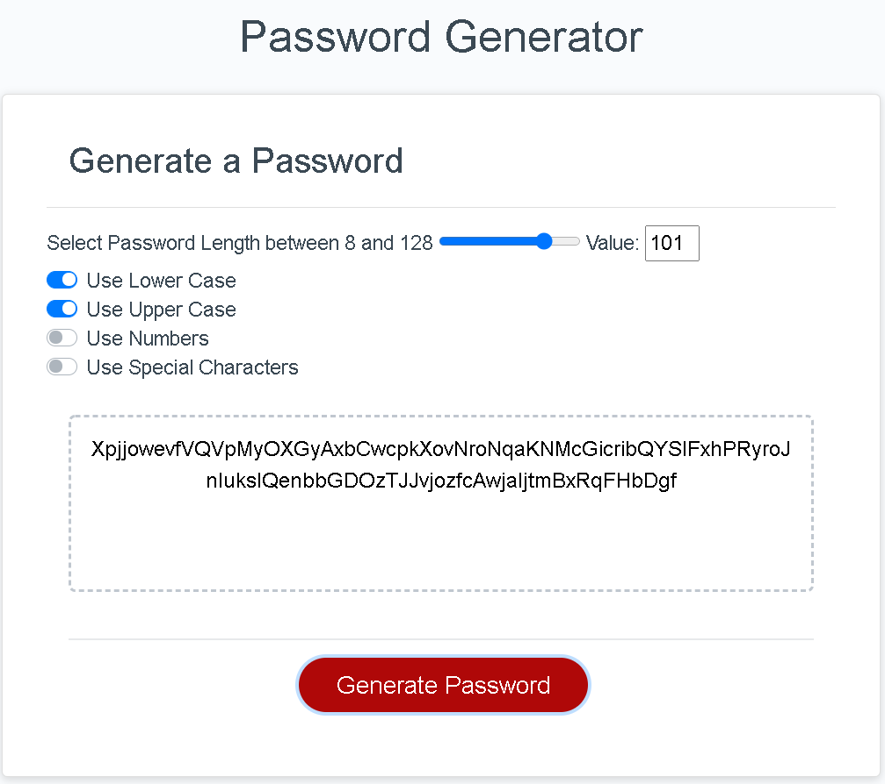

## 03 JavaScript: Password Generator

This assignment focus on random password generation depending on the inputs like password length, use lowercase, use uppercase, use numbers, use special characters from the user. Generating a unique, strong password is required for different websites for security reasons and also to avoid hacking. The application is developed using HTML, CSS, and Javascript. This is made responsive so that to use on various devices and screen sizes.

### Functionality of the application

* The user clicks the "Generate Password" button.
* The user will be prompted to enter the length of the password.
* Validation should be done to ensure the range is between 8 and 128 and no other special characters in the password length field.
* Then the user will be prompted to enter lowercase, uppercase, numeric, and/or special characters to include in the password.
* The input is validated, and at least one character type should be selected. If no character type is selected, then the message "Please select a character type!!!" will be shown.
* The password will be generated by matching all the criteria selected.
* The generated password will be displayed on the page. 

### Implementation

* Included a slider for entering the password length, the user can slide between 8 and 128, and moreover, the code for validation not needed by implementing this way. The selected value is shown at the side of the slider.
* Used Toggle icons for selecting the character type. By using this enable/disable feature, users can easily choose between different character types lowercase, uppercase, numbers, special characters for their password.
* If nothing is selected, then a message "Please select a Character type" is shown.
* After selecting the length, characters for the password and on clicking "Generate password" displays the newly generated password on the "Your secure password" text area.
* Added necessary comments for easy understanding.

#### Screenshots

Here's the link to my developed Website : [Javascript-PasswordGenerator](https://yakinia.github.io/03-Javascript-PasswordGenerator/)

#### References

W3Schools  : [W3Schools - Slider](https://www.w3schools.com/tags/att_input_type_range.asp) 
StackOverflow: [StackOverflow - Display Slider Value](https://stackoverflow.com/questions/10004723/html5-input-type-range-show-range-value) 
Bootstrap  : [Bootstrap - Toggle Switch](https://getbootstrap.com/docs/4.5/components/forms/#switches)
